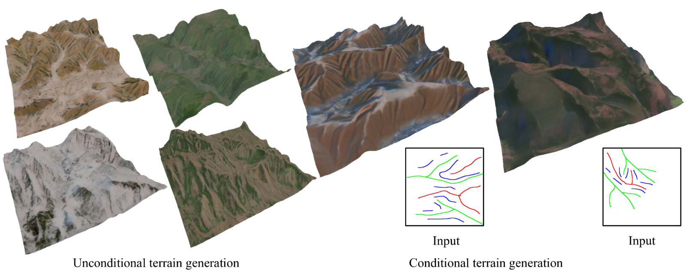

# terra-fusion
<div align="center" style="background-color: white;">
    
</div>

## TerraFusion: Joint Generation Terrain Geometry and Texture Using Latent Diffusion Models


[](https://millennium-nova.github.io/terra-fusion-page/)

## Quick Start

First, clone this repository:

```bash
git clone https://github.com/millennium-nova/terra-fusion.git
cd terra-fusion
```
Next, set up the required environment using the provided `environment.yaml` file:

```bash
conda env create -f environment.yaml
conda activate uncond-terrain-ldm
```

Then, simply run the following command to begin:

```bash
CUDA_VISIBLE_DEVICES=0 python uncond-inference.py --num_samples=8 --batch_size=4
```

This will start the inference process using GPU 0.

> **Note**: Sketch-based inference will be released soon.

## License

This project is licensed under the [PolyForm Noncommercial License 1.0.0](LICENSE).

## Citation

If you use this code in your research, please cite our work using the following BibTeX entry:

```bibtex
@article{higo2025terrafusion,
    title={TerraFusion: Joint Generation of Terrain Geometry and Texture Using Latent Diffusion Models},
    author={Kazuki Higo and Toshiki Kanai and Yuki Endo and Yoshihiro Kanamori},
    journal={Virtual Reality & Intelligent Hardware Journal},
    volume={},
    number={},
    pages={0-0},
    year={2025},
}
```