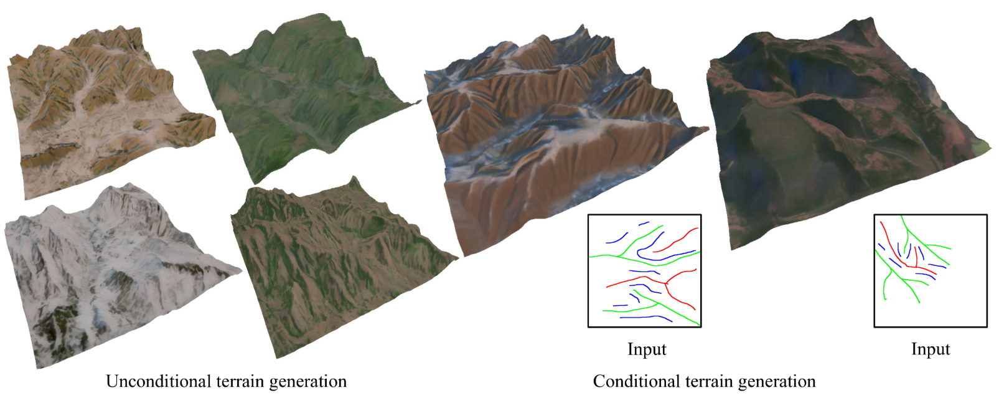

# terra-fusion
<div align="center">
    
</div>

## TerraFusion: Joint Generation Terrain Geometry and Texture Using Latent Diffusion Models


[](https://millennium-nova.github.io/terra-fusion-page/)

## Quick Start

First, clone this repository:

```bash
git clone https://github.com/millennium-nova/terra-fusion.git
cd terra-fusion
```

### Option A: Setup with pixi (Recommended)

```bash
pixi install
```

### Option B: Setup with Conda

```bash
conda env create -f environment.yaml
conda activate uncond-terrain-ldm
```

## Sketch-Based Inference

Sketch-based inference lets you control terrain generation by providing a hand-drawn sketch.

### Sketch Color Conventions

| Color | Feature |
|-------|---------|
| 🔴 Red `(255, 0, 0)` | Valley |
| 🟢 Green `(0, 255, 0)` | Ridge |
| 🔵 Blue `(0, 0, 255)` | Cliff |

The sketch should be drawn on a **black background**.

Pre-made template sketches are provided in the `sketches/` directory.

### Running Sketch-Based Inference

```bash
CUDA_VISIBLE_DEVICES=0 python sketch-inference.py --sketch_image sketches/sketch3.png --num_samples=1 --batch_size=1 --seed=42
```

### Drawing Your Own Sketches

```bash
python draw_sketch.py
```


## Unconditional Inference

```bash
CUDA_VISIBLE_DEVICES=0 python uncond-inference.py --num_samples=8 --batch_size=4 --seed=42
```

Omit `--seed` to use a random seed. The selected seed is printed at startup so
the run can be reproduced later.

## Mesh Export

Convert a generated heightmap and texture into a triangle mesh with vertex colors:

```bash
python export-mesh.py \
  --heightmap inference_outputs/<run>/heightmap/heightmap_000000.tif \
  --texture inference_outputs/<run>/texture/texture_000000.png \
  --output terrain.ply
```

## License

This project is licensed under the [PolyForm Noncommercial License 1.0.0](LICENSE).

## Citation

If you use this code in your research, please cite our work using the following BibTeX entry:

```bibtex
@article{higo2025terrafusion,
    title={TerraFusion: Joint Generation of Terrain Geometry and Texture Using Latent Diffusion Models},
    author={Kazuki Higo and Toshiki Kanai and Yuki Endo and Yoshihiro Kanamori},
    journal={Virtual Reality & Intelligent Hardware Journal},
    volume={7},
    number={6},
    pages={560-576},
    year={2025},
}
```
